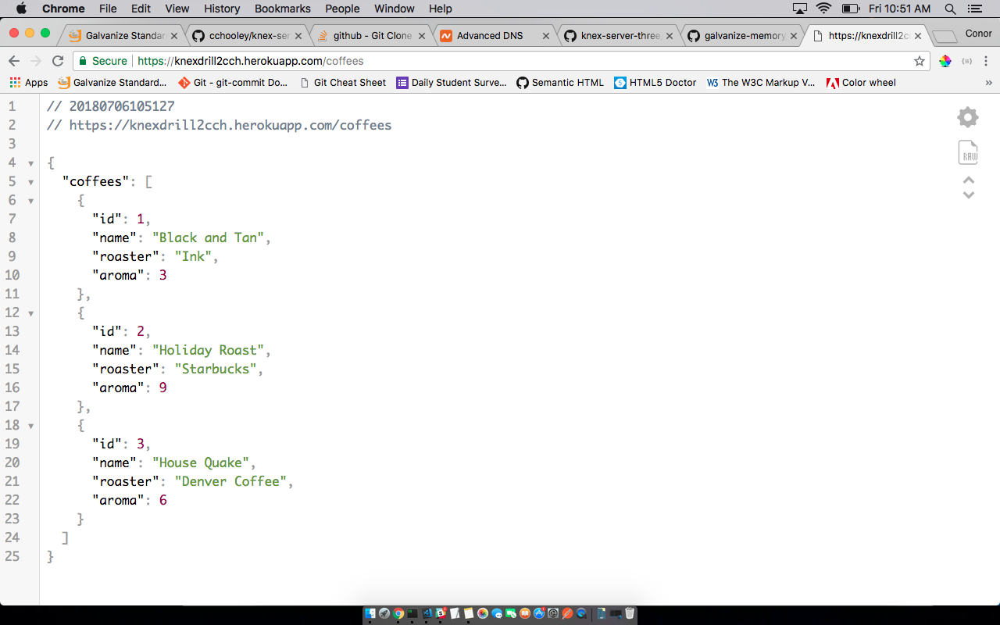

# Galvanize Memory Drill 2

This is a server that was created with Knex, Express, Node and Heroku. It stores information on various coffees, with keys for name, roaster, and aroma.

## Installation

Run `npm install` to install dependencies.

## Serving

Run `npm start` to serve locally on port 3000. Testing CRUD functionality with [Postman](https://www.getpostman.com/) highly recommended.

Run `npm test` to test.

## Contact info
cchooley@gmail.com
https://www.linkedin.com/in/conor-hooley/